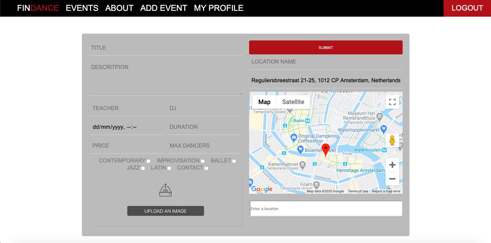

# FINDANCE

Findance is a fullstack app where users can search for, join/leave or add dance classes.
Not evryone is using Facebook and it's nice to have different classes in the same place!

## Frontend Technology

###### React
This app was created with create-react-app
There are both class components and non-class components with hooks.
Google Maps API was integrated with react-google-maps

###### Redux
Data was fetched using a thunk and AXIOS.

###### CSS
Nothing else was used for styling.

## Backend Technology

The backend was built with Node.js, Express, PostgreSQL, Sequelize & Docker
[Click here to check the repository](https://github.com/mariazangelova/findance-server)

## Features

SEE EVENTS

The video below presents how the page has been styled. The animation is pure CSS.

JOIN/LEAVE

Each event has its own page with details, list of participants and address along with Google Maps. With a single click users can join or leave the event. Using state management, no refreshing is needed to see changes.

ADD EVENTS

Logged in users can add events with the form as can be seen on the screenshot below. The images are uploaded to Cloudinary and the search address uses Google Geocode and Geolocation to automaitcally show location when the user starts typing.

